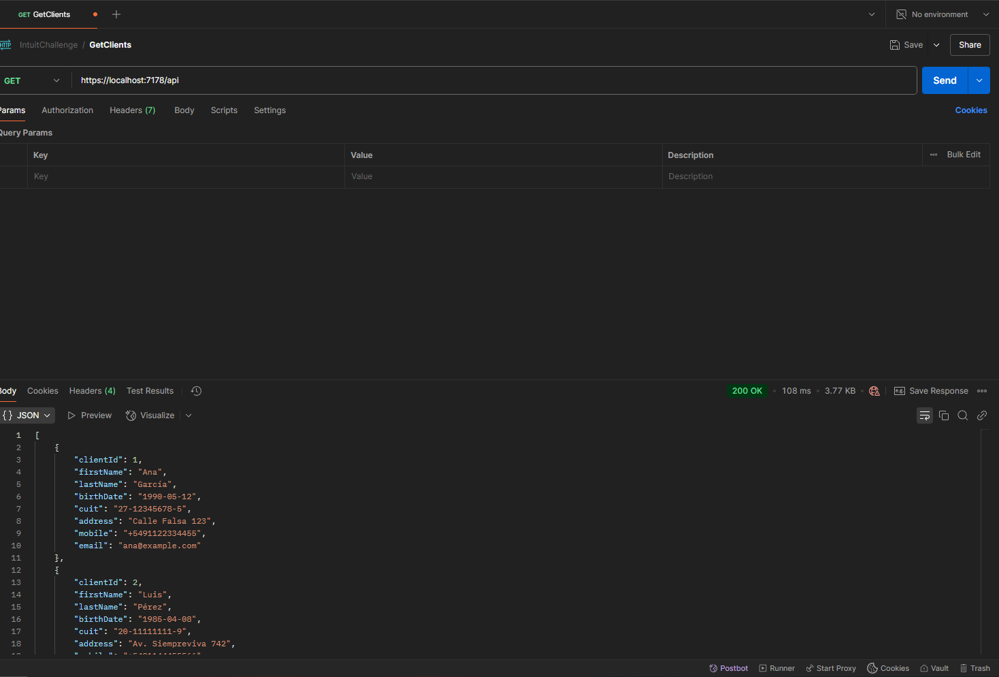
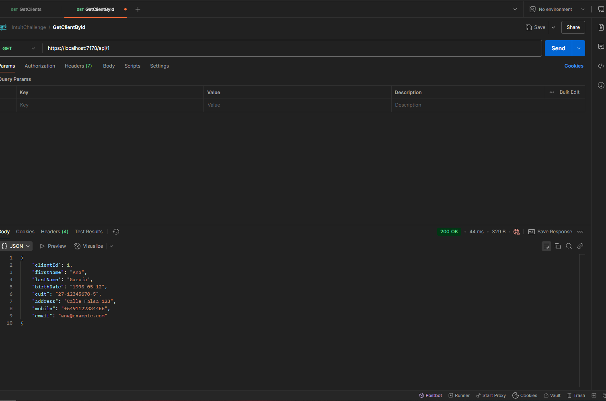
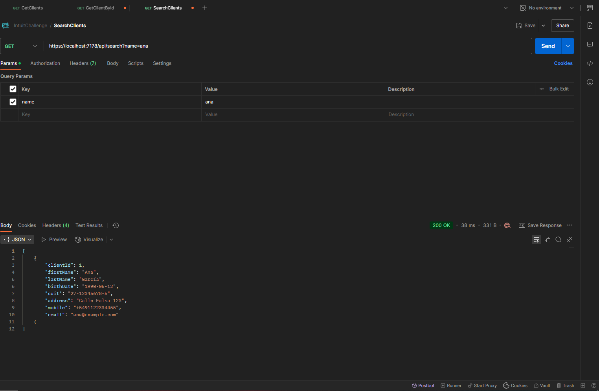
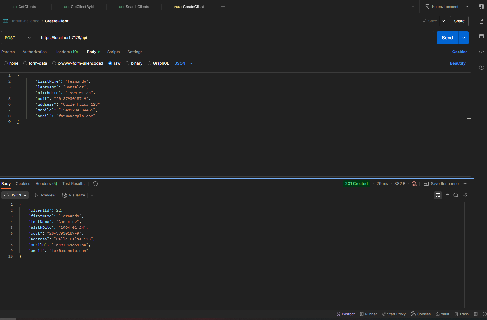
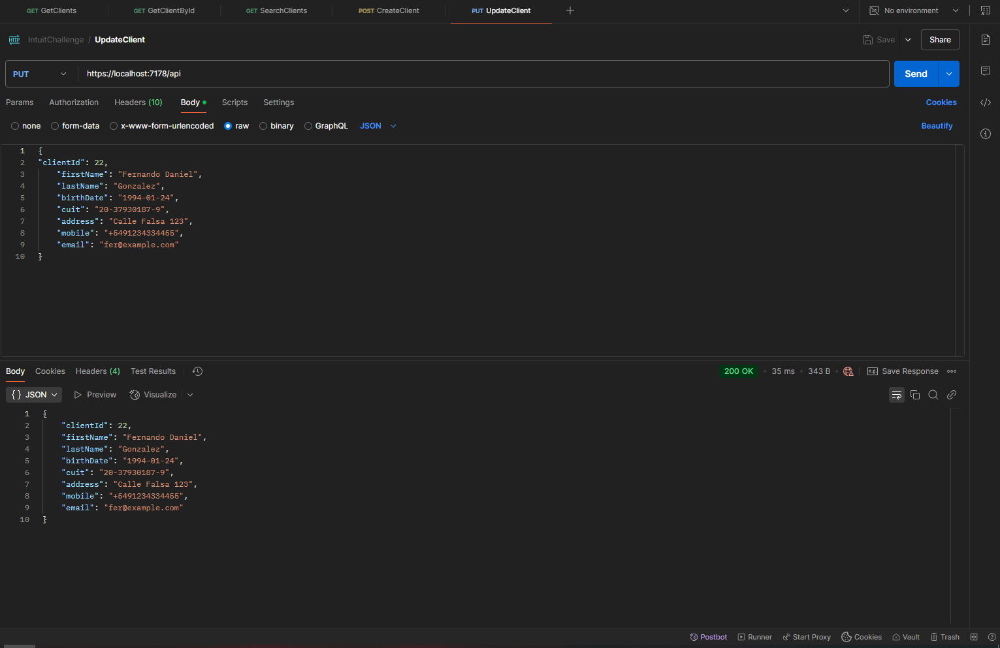
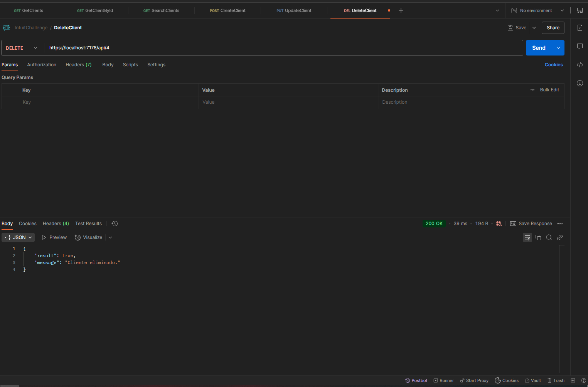
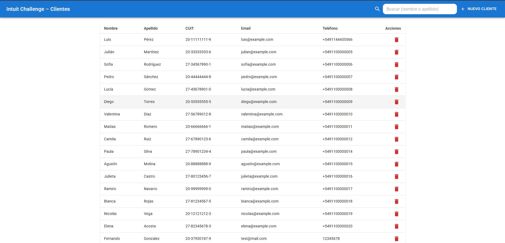

# IntuitChallenge – Documentación Backend API REST


---

      

---

## 1. Stack & Principios

**Tecnologías**
- .NET 8 (ASP.NET Core Web API)
- C# 12 
- Entity Framework Core + Npgsql (PostgreSQL)
- Serilog (logs a consola y archivo)
- Swagger/Swashbuckle 
- Visual Studio 2022

**Principios de diseño**
- **RESTful**: Rutas basadas en recursos (\`/api/clients\`), verbos HTTP expresan la acción.
- **DTOs**: Separación entre modelo de dominio y contratos de API (ClientCreateDto, ClientUpdateDto, ClientReadDto).
- **Async/Await**: Todas las operaciones de I/O son asíncronas.
- **Inyección de dependencias**: Se utiliza el contenedor de servicios de .NET para gestionar dependencias.
- **Separation of Concerns**: Controladores, Servicios, Repositorios, Modelos, DTOs, Validaciones y Logging están separados para facilitar el mantenimiento y la escalabilidad.
- **Repository Pattern**: Abstracción de acceso a datos mediante repositorios genéricos y específicos.
- **Inmutabilidad**: Los DTOs son inmutables, se crean con todos sus datos en el constructor.
- **Manejo de resultados**:
  - **ServiceResult** → 200/201/204/400/404/409 (flujos esperables).
  - **AppException** → Utilizado para errores inesperados (500) y errores de infraestructura (DB).
- **Logging**: Serilog para trazabilidad de requests y errores.
- **Validaciones**: Atributos (CUIT, fecha de nacimiento en el pasado). 
- **Índices únicos** en BD (CUIT y Email) para integridad.
- **Swagger**: Documentación automática con OperationId igual al nombre del método para facilitar pruebas.
- **Health Checks**: Endpoint opcional para monitoreo de salud de la API y conexión a BD.
- **CORS**: Configuración abierta para desarrollo, se recomienda restringir en producción.
- **Configuración sensible**: Uso de User Secrets o variables de entorno para cadenas de conexión.

---

## 2. Estructura del proyecto

```
Intuit.Api
│
├── Connected Services
├── Dependencias
├── Properties
│
├── Controllers
│   └── ClientsController.cs
│
├── Data
│   ├── Repository
│   │   ├── ClientRepository.cs
│   │   ├── Repository.cs
│   │
│   └── IntuitDBContext.cs
│
├── Domain
│   └── Client.cs
│
├── Dtos
│   ├── ClientCreateDto.cs
│   ├── ClientReadDto.cs
│   └── ClientUpdateDto.cs
│
├── Exceptions
│   └── AppException.cs
│
├── Interfaces
│   ├── IClientRepository.cs
│   ├── IClientService.cs
│   ├── IRepository.cs
│   └── IService.cs
│
├── LogFile
│   ├── Log-20250909.txt
│   └── Log-20250910.txt
│
├── Logging
│   ├── ILogService.cs
│   ├── LoggerConfig.cs
│   └── LogService.cs
│
├── Migrations
│   ├── 20250911002204_initial.cs
│   └── IntuitDBContextModelSnapshot.cs
│
├── Models
│   └── ServiceResult.cs
│
├── Services
│   ├── AppService.cs
│   └── ClientService.cs
│
├── Validations
│   ├── BirthDateInPastAttribute.cs
│   └── CuitAttribute.cs
│
├── appsettings.json
└── Program.cs

```
---

## 3. Modelo de dominio

**Entidad: `Client`**
- `ClientId` (PK, identity)
- `FirstName` (requerido, max 100)
- `LastName` (requerido, max 100)
- `BirthDate` (DateOnly, requerido)
- `Cuit` (requerido, max 20, **único**; validación y verificador)
- `Address` (opcional, max 200)
- `Mobile` (requerido, max 30)
- `Email` (requerido, max 200, **único**)

**Índices**
- Índice único en `Cuit`
- Índice único en `Email`

**Seed**
- Se agregaron varios clientes en la migración inicial para pruebas.

---

## 3.1 Contratos (DTOs)

**ClientCreateDto**
```json
{
  "firstName": "string (required)",
  "lastName": "string (required)",
  "birthDate": "YYYY-MM-DD (required, past)",
  "cuit": "string (required, valid CUIT)",
  "address": "string (optional)",
  "mobile": "string (required)",
  "email": "string (required, email)"
}
```

**ClientUpdateDto** = `ClientCreateDto` + `clientId` (required)

**ClientReadDto**
```json
{
  "clientId": 0,
  "firstName": "string",
  "lastName": "string",
  "birthDate": "YYYY-MM-DD",
  "cuit": "string",
  "address": "string | null",
  "mobile": "string",
  "email": "string"
}
```

---

## 4. Manejo de resultados y errores

**ServiceResult**
- Clase genérica para resultados de negocio esperables.
- `Result` (bool): éxito/fracaso de negocio
- `Status` (int): mapea a HTTP (200, 201, 204, 400, 404, 409)
- `Message` (string?): explicación humana
- `Data` (object?): payload (DTO/Lista)

**AppException**
- Excepción personalizada para errores inesperados.
- Se lanza ante **errores inesperados/infraestructura** (p. ej. `DbUpdateException`, `DbException`).

**Concurrencia**
- `DbUpdateConcurrencyException` → traducida a **409 Conflict** en el **Service**. 

**Validaciones y duplicados**
- Reglas esperables → **NO** excepción; el service devuelve `ServiceResult.Validation/Conflict/NotFound`.

---

## 5. Logging

**Serilog**
- Se utilizo Serilog para logging estructurado.
- Logs configurados para consola y archivo (`LogFile/Log-YYYYMMDD.txt`).

---

## 6. CORS

Se permiten todos los orígenes para facilitar pruebas desde Postman/Frontends locales. 

---

### 7 Crear base y usuario (psql)
```sql
-- Abrir consola psql como superusuario (postgres) y ejecutar:
CREATE DATABASE intuitdb;
CREATE USER intuituser WITH PASSWORD 'IntuitPwd!';
GRANT ALL PRIVILEGES ON DATABASE intuitdb TO intuituser;
-- (opcional) Habilitar privilegios en esquema público si es necesario
```

### 7.1 Cadena de conexión (appsettings.Development.json)

`Intuit.Api/appsettings.Development.json`
```json
{
  "ConnectionStrings": {
    "PostgreSQL": "Host=localhost;Port=5432;Database=intuitdb;Username=intuituser;Password=IntuitPwd!"
  }
}
```

> Alternativa: **User Secrets**:
```bash
# 1) Secrets 
cd src/Intuit.Api
dotnet user-secrets init
dotnet user-secrets set "ConnectionStrings:PostgreSQL" "Host=localhost;Port=5432;Database=intuitdb;Username=intuituser;Password=IntuitPwd!"
```

### 7.2 Migraciones EF Core
```bash
# Crear migración inicial (en el proyecto que contiene el DbContext)
# Ubicate en src/Intuit.Api (o el proyecto de inicio) y ajustá --project si el DbContext está en otra lib

dotnet ef migrations add Init --context IntuitDBContext

dotnet ef database update --context IntuitDBContext
```

### 7.3 Ejecutar la API
```bash
cd Intuit.Api

dotnet run
# Abrir Swagger: https://localhost:{PORT}/swagger
```

---

## 8 Health Checks
```csharp
// Program.cs
builder.Services.AddHealthChecks().AddNpgSql(builder.Configuration.GetConnectionString("PostgreSQL")!);
app.MapHealthChecks("/health");
```

**Probar**
```bash
curl https://localhost:PORT/health
```

---

## 9. API Endpoints

📌 **Base URL (por defecto):**
```
https://localhost:{PORT}/api/clients
```

---

## 9.1 Pruebas de la API en Postman y cURL

## Métodos y rutas

| OperationId       | Método | Ruta                              | Descripción                                                |
| ----------------- | ------ | --------------------------------- | ---------------------------------------------------------- |
| **GetClients**    | GET    | `/api/clients`                    | Lista todos los clientes                                   |
| **GetClientById** | GET    | `/api/clients/{id}`               | Obtiene un cliente por Id                                  |
| **SearchClients** | GET    | `/api/clients/search?name={name}` | Búsqueda por nombre/apellido (substring, case-insensitive) |
| **CreateClient**  | POST   | `/api/clients`                    | Crea un cliente                                            |
| **UpdateClient**  | PUT    | `/api/clients/{id}`               | Actualiza un cliente (Id de ruta = `clientId` del body)    |
| **DeleteClient**  | DELETE | `/api/clients/{id}`               | Elimina un cliente                                         |

---

## cURL

### Listar todos



```bash
  curl -X 'GET' \
    'https://localhost:7178/api' \
    -H 'accept: text/plain'
```

### Obtener por id



```bash
  curl -X 'GET' \
    'https://localhost:7178/api/1' \
    -H 'accept: text/plain'
```

### Búsqueda (name)



```bash
  curl -X 'GET' \
    'https://localhost:7178/api/search?name=ana' \
    -H 'accept: text/plain'
```

### Crear

 

```bash
  curl -X 'POST' \
    'https://localhost:7178/api' \
    -H 'accept: text/plain' \
    -H 'Content-Type: application/json' \
    -d '{
          "firstName": "Fernando",
          "lastName": "Gonzalez",
          "birthdate": "1994-01-24",
          "cuit": "20-37930187-9",
          "address": "Calle Falsa 123",
          "mobile": "+5491234334455",
          "email": "fer@example.com"
  }'
```

### Actualizar (Id de ruta = clientId del body)

 

```bash
  curl -X 'PUT' \
    'https://localhost:7178/api' \
    -H 'accept: text/plain' \
    -H 'Content-Type: application/json' \
    -d '{
  "clientId": 22,
      "firstName": "Fernando Daniel",
      "lastName": "Gonzalez",
      "birthDate": "1994-01-24",
      "cuit": "20-37930187-9",
      "address": "Calle Falsa 123",
      "mobile": "+5491234334455",
      "email": "fer@example.com"
  }'
```

### Eliminar

 

```bash
  curl -X 'DELETE' \
    'https://localhost:7178/api/4' \
    -H 'accept: */*'
```

---

## 10. Postman Collection

Se guardo la colección como `Docs/IntuitChallenge.postman_collection.json` para **Importar** en Postman.

---

# Frontend (React + TypeScript + Material UI)

 

---
***Se creo una UI mínima para listar, buscar, crear y eliminar clientes contra la API REST desarrollada en .NET.***

---
## Stack
- **React** + **TypeScript** (Vite)
- **Material UI** (MUI)
- **fetch** nativo (sin axios)
- Configurable por **`.env`**

## Requisitos
- Node.js 18+ / 20+
- Backend corriendo (ver sección API)

## Instalación y ejecución
```bash
# Entrar al proyecto del front
cd Intuit-UI

# Instalar dependencias
npm install

# Definir la URL del backend
# (crear archivo .env en la raíz de Intuit-UI)
# VITE_API_BASE_URL=https://localhost:7178

# Ejecutar en desarrollo (Vite)
npm run dev
# Abrir http://localhost:5173
```

> **CORS:** La API permite todos los orígenes para facilitar pruebas desde frontends locales.

## Estructura
```
Intuit-UI/
├─ .env                           # VITE_API_BASE_URL
├─ src/
│  ├─ App.tsx                     # UI: AppBar + búsqueda + tabla + diálogo crear
│  ├─ api.ts                      # llamadas fetch (GET/POST/DELETE/SEARCH)
│  ├─ types.ts                    # DTOs (ClientReadDto, etc.)
│  ├─ theme.ts                    # (opcional) tema MUI
│  ├─ main.tsx                    # ThemeProvider + CssBaseline
│  └─ index.css                   # estilos mínimos
```

## Endpoints consumidos
- `GET /api` – listar todos los clientes
- `GET /api/search?name={texto}` – búsqueda (nombre/apellido, case-insensitive)
- `POST /api` – crear cliente
- `DELETE /api/{id}` – eliminar cliente

## Comportamiento de la UI
- **Búsqueda** con pequeño *debounce* (300 ms). 
- **Feedback** de éxito/error con *Snackbars* de MUI.
- **Tabla** simple con acciones (crear / eliminar). 
- **Validación mínima** en el formulario (campos requeridos básicos). 

---

by Fernando Daniel Gonzalez - [GitHub](https://github.com/kaiserkey) - [LinkedIn](https://www.linkedin.com/in/danielsan94/)

