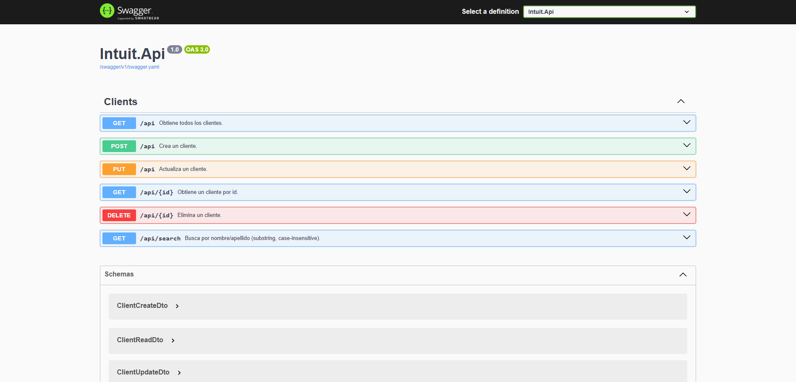

# IntuitChallenge – Documentación Backend API REST



---

      

---

## 1. Stack & Principios

**Tecnologías**
- .NET 8 (ASP.NET Core Web API)
- C# 12 
- Entity Framework Core + Npgsql (PostgreSQL)
- Serilog (logs a consola y archivo)
- Swagger/Swashbuckle 
- Visual Studio 2022

**Principios de diseño**
- **RESTful**: Rutas basadas en recursos (\`/api/clients\`), verbos HTTP expresan la acción.
- **DTOs**: Separación entre modelo de dominio y contratos de API (ClientCreateDto, ClientUpdateDto, ClientReadDto).
- **Async/Await**: Todas las operaciones de I/O son asíncronas.
- **Inyección de dependencias**: Se utiliza el contenedor de servicios de .NET para gestionar dependencias.
- **Separation of Concerns**: Controladores, Servicios, Repositorios, Modelos, DTOs, Validaciones y Logging están separados en capas.
- **Repository Pattern**: Abstracción de acceso a datos mediante repositorios genéricos y específicos.
- **Inmutabilidad**: Los DTOs son inmutables, se crean con todos sus datos en el constructor.
- **Manejo de resultados**:
  - **ServiceResult** → 200/201/204/400/404/409 (flujos esperables).
  - **AppException** → Utilizado para errores inesperados (500) y errores de infraestructura (DB).
- **Logging**: Serilog para trazabilidad de requests y errores.
- **Validaciones**: Atributos (CUIT, fecha de nacimiento en el pasado). 
- **Índices únicos** en BD (CUIT y Email) para integridad.
- **Swagger**: Documentación automática con OperationId igual al nombre del método para facilitar pruebas.
- **Health Checks**: Endpoint opcional para monitoreo de salud de la API y conexión a BD.
- **CORS**: Configuración abierta para desarrollo, se recomienda restringir en producción.
- **Configuración sensible**: Uso de User Secrets o variables de entorno para cadenas de conexión.

---

## 2. Estructura del proyecto

```
Intuit.Api
│
├── Connected Services
├── Dependencias
├── Properties
│
├── Controllers
│   └── ClientsController.cs
│
├── Data
│   ├── Repository
│   │   ├── ClientRepository.cs
│   │   ├── Repository.cs
│   │
│   └── IntuitDBContext.cs
│
├── Domain
│   └── Client.cs
│
├── Dtos
│   ├── ClientCreateDto.cs
│   ├── ClientReadDto.cs
│   └── ClientUpdateDto.cs
│
├── Exceptions
│   └── AppException.cs
│
├── Interfaces
│   ├── IClientRepository.cs
│   ├── IClientService.cs
│   ├── IRepository.cs
│   └── IService.cs
│
├── LogFile
│   ├── Log-20250909.txt
│   └── Log-20250910.txt
│
├── Logging
│   ├── ILogService.cs
│   ├── LoggerConfig.cs
│   └── LogService.cs
│
├── Migrations
│   ├── 20250911002204_initial.cs
│   └── IntuitDBContextModelSnapshot.cs
│
├── Models
│   └── ServiceResult.cs
│
├── Services
│   ├── AppService.cs
│   └── ClientService.cs
│
├── Validations
│   ├── BirthDateInPastAttribute.cs
│   └── CuitAttribute.cs
│
├── appsettings.json
└── Program.cs

```
---

## 3. Modelo de dominio

**Entidad: `Client`**
- `ClientId` (PK, identity)
- `FirstName` (requerido, max 100)
- `LastName` (requerido, max 100)
- `BirthDate` (DateOnly, requerido)
- `Cuit` (requerido, max 20, **único**; validación y verificador)
- `Address` (opcional, max 200)
- `Mobile` (requerido, max 30)
- `Email` (requerido, max 200, **único**)

**Índices**
- Índice único en `Cuit`
- Índice único en `Email`

**Seed**
- Se agregaron varios clientes en la migración inicial para pruebas.

---

## 4. API Endpoints

📌 **Base URL (por defecto):**
```
https://localhost:{PORT}/api/clients
```

---

### 4.1 Listar todos
- **GET** `/api/clients`
- **OperationId**: `GetClients`
- **200 OK** → `ClientReadDto[]`

**cURL**
```bash
curl https://localhost:PORT/api/clients
```

---

### 4.2 Obtener por id
- **GET** `/api/clients/{id}`
- **OperationId**: `GetClientById`
- **200 OK** → `ClientReadDto`  
- **404 NotFound**

**cURL**
```bash
curl https://localhost:PORT/api/clients/1
```

---

### 4.3 Búsqueda por nombre/apellido (substring, case-insensitive)
- **GET** `/api/clients/search?name={texto}`
- **OperationId**: `SearchClients`
- **200 OK** → `ClientReadDto[]` (puede ser vacío)

**cURL**
```bash
curl "https://localhost:PORT/api/clients/search?name=gar"
```

---

### 4.4 Crear
- **POST** `/api/clients`
- **OperationId**: `CreateClient`
- **Body**: `ClientCreateDto`
- **201 Created** → `ClientReadDto` + header `Location` (con `GetById`)  
- **409 Conflict** (CUIT/Email duplicado)  
- **400 BadRequest** (validación DTO)

**Body ejemplo**
```json
{
  "firstName": "Ana",
  "lastName": "García",
  "birthDate": "1990-05-12",
  "cuit": "27-12345678-5",
  "address": "Calle Falsa 123",
  "mobile": "+5491122334455",
  "email": "ana@example.com"
}
```

**cURL**
```bash
curl -X POST https://localhost:PORT/api/clients \
 -H "Content-Type: application/json" \
 -d '{
   "firstName":"Ana",
   "lastName":"García",
   "birthDate":"1990-05-12",
   "cuit":"27-12345678-5",
   "address":"Calle Falsa 123",
   "mobile":"+5491122334455",
   "email":"ana@example.com"
 }'
```

---

### 4.5 Actualizar
- **PUT** `/api/clients`
- **OperationId**: `UpdateClient`
- **Body**: `ClientUpdateDto`
- **200 OK** → `ClientReadDto`  
- **404 NotFound** (id inexistente)  
- **409 Conflict** (CUIT/Email de otro cliente)

**Body ejemplo**
```json
{
  "clientId": 1,
  "firstName": "Ana",
  "lastName": "García",
  "birthDate": "1990-05-12",
  "cuit": "27-12345678-5",
  "address": "Av. Siempreviva 742",
  "mobile": "+5491122334455",
  "email": "ana@example.com"
}
```

**cURL**
```bash
curl -X PUT https://localhost:PORT/api/clients \
 -H "Content-Type: application/json" \
 -d '{
   "clientId":1,
   "firstName":"Ana",
   "lastName":"García",
   "birthDate":"1990-05-12",
   "cuit":"27-12345678-5",
   "address":"Av. Siempreviva 742",
   "mobile":"+5491122334455",
   "email":"ana@example.com"
 }'
```

---

### 4.6 Eliminar
- **DELETE** `/api/clients/{id}`
- **OperationId**: `DeleteClient`
- **204 NoContent**  
- **404 NotFound**

**cURL**
```bash
curl -X DELETE https://localhost:PORT/api/clients/1
```

---

## 5. Contratos (DTOs)

**ClientCreateDto**
```json
{
  "firstName": "string (required)",
  "lastName": "string (required)",
  "birthDate": "YYYY-MM-DD (required, past)",
  "cuit": "string (required, valid CUIT)",
  "address": "string (optional)",
  "mobile": "string (required)",
  "email": "string (required, email)"
}
```

**ClientUpdateDto** = `ClientCreateDto` + `clientId` (required)

**ClientReadDto**
```json
{
  "clientId": 0,
  "firstName": "string",
  "lastName": "string",
  "birthDate": "YYYY-MM-DD",
  "cuit": "string",
  "address": "string | null",
  "mobile": "string",
  "email": "string"
}
```

---

## 6. Manejo de resultados y errores

**ServiceResult**
- Clase genérica para resultados de negocio esperables.
- `Result` (bool): éxito/fracaso de negocio
- `Status` (int): mapea a HTTP (200, 201, 204, 400, 404, 409)
- `Message` (string?): explicación humana
- `Data` (object?): payload (DTO/Lista)

**AppException**
- Excepción personalizada para errores inesperados.
- Se lanza ante **errores inesperados/infraestructura** (p. ej. `DbUpdateException`, `DbException`).

**Concurrencia**
- `DbUpdateConcurrencyException` → traducida a **409 Conflict** en el **Service**. 

**Validaciones y duplicados**
- Reglas esperables → **NO** excepción; el service devuelve `ServiceResult.Validation/Conflict/NotFound`.

---

## 7. Logging

**Serilog**
- Se utilizo Serilog para logging estructurado.
- Logs configurados para consola y archivo (`LogFile/Log-YYYYMMDD.txt`).

---

### 8.1 Requisitos
- .NET 8 SDK
- PostgreSQL 14+ (recomendado 16)
- Acceso a GUI (pgAdmin)

### 8.2 Crear base y usuario (psql)
```sql
-- Abrir consola psql como superusuario (postgres) y ejecutar:
CREATE DATABASE intuitdb;
CREATE USER intuituser WITH PASSWORD 'IntuitPwd!';
GRANT ALL PRIVILEGES ON DATABASE intuitdb TO intuituser;
-- (opcional) Habilitar privilegios en esquema público si es necesario
```

### 8.3 Cadena de conexión (appsettings.Development.json)

`Intuit.Api/appsettings.Development.json`
```json
{
  "ConnectionStrings": {
    "PostgreSQL": "Host=localhost;Port=5432;Database=intuitdb;Username=intuituser;Password=IntuitPwd!;Include Error Detail=true"
  },
  "Serilog": {
    "MinimumLevel": "Information"
  }
}
```

> Alternativa: **User Secrets**:
```bash
cd src/Intuit.Api
dotnet user-secrets init
dotnet user-secrets set "ConnectionStrings:PostgreSQL" "Host=localhost;Port=5432;Database=intuitdb;Username=intuituser;Password=IntuitPwd!;Include Error Detail=true"
```

### 8.5 Migraciones EF Core
```bash
# Crear migración inicial (en el proyecto que contiene el DbContext)
# Ubicate en src/Intuit.Api (o el proyecto de inicio) y ajustá --project si el DbContext está en otra lib

dotnet ef migrations add Init --context IntuitDBContext

dotnet ef database update --context IntuitDBContext
```

### 8.6 Ejecutar la API
```bash
cd Intuit.Api
dotnet run
# Abrir Swagger: https://localhost:{PORT}/swagger
```

---

## 10. Health Checks
```csharp
// Program.cs
builder.Services.AddHealthChecks().AddNpgSql(builder.Configuration.GetConnectionString("PostgreSQL")!);
app.MapHealthChecks("/health");
```

**Probar**
```bash
curl https://localhost:PORT/health
```

---

## 11. CORS

Se permiten todos los orígenes en desarrollo. En producción, restringir a dominios específicos.

---

by Fernando Daniel Gonzalez - [GitHub](https://github.com/kaiserkey) - [LinkedIn](https://www.linkedin.com/in/danielsan94/)